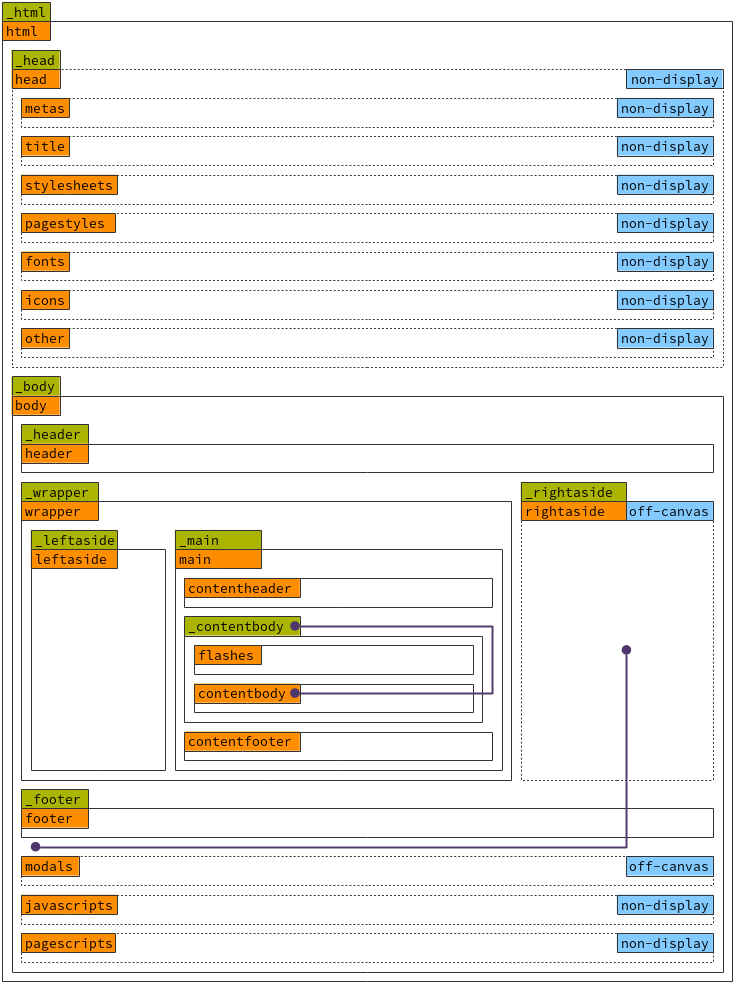

# MesdPresentationBundle

v.4.0.1

## Notes!!!

I'll probably change a few things. Notably block names. I might switch styles and scripts to pagestyles and pagescripts. And possibly change shim to other. Since we don't really need a shim anymore and we do need to be able to list things like robots.txt and sitemap.xml and such.

I need to include more information on certain libraries. Some libraries included with AdminLTE are very old and when feasible or necessary, more recent versions are included in the parent `node_modules` directory. The assetic file included with this project has examples of how to point a `named javascript library` to a different resource.

## Introduction

The Presentation Bundle is no longer a standalone implementation of Bootstrap.
After much consideration, I have chosen to integrate the existing open-source
AdminLTE (CSS and JS framework) project into the bundle. AdminLTE has several
benefits over rolling our own presentation. That is, most notably, we now have
a compliment of developers contributing and improving on our theme.

## Dependencies

Being that this bundle is for Symfony projects, a few PHP projects are needed
for this bundle to work:

* [Symfony](//symfony.com) ^v2.8
* [Twig](//twig.symfony.com) v1.0.*||v.2.0*
* [Assetic](//symfony.com/doc/current/assetic/asset_management.html) ^v1.4

The Presentation Bundle relies heavily on several css and js libraries and
packages, they are as follows:

* [AdminLTE](https://almsaeedstudio.com/themes/AdminLTE/index2.html) v2.3.11
* [Bootstrap](http://getbootstrap.com/) v3.*
* [Node JS](http://getbootstrap.com/) version unknown
* [Node Package Manager](http://getbootstrap.com/) version unknown
* [Font-Awesome]
* [Moment]
* [Mousetrap]
* [Selectize]
* [Source-Code-Pro]
* [Source-Sans-Pro]

Optionally, AdminLTE has a bunch of plugins available as well. Many of these
plugins are maintained in the Presentation node modules directory which are
later versions of the projects. By default, the Presentation assets are pointed
to this directory rather than the AdminLTE plugins directory. They are:

* [Slider for Bootstrap](http://seiyria.com/bootstrap-slider/)
* [Bootstrap WYSIHTML5](http://bootstrap-wysiwyg.github.io/bootstrap3-wysiwyg/)
* [Chart JS]()
* [CKEditor]()
* [Colorpicker]()
* [Datatables]()
* [Datepicker]()
* [Daterangepicker]()
* [Fastclick]()
* [Flot]()
* [Full Calendar]()
* [iCheck]()
* [Input Mask]()
* [Ion Slider]()
* [jQuery]()
* [jQueryUI]()
* [jVectorMap]()
* [Knob]()
* [Morris Charts]()
* [Pace]()
* [Select2]()
* [Slim Scroll]()
* [Sparkline]()
* [Timepicker]()

## Recommendations and Compatibilities

This bundle works out of the box with other MESD owned bundles. They are:

* [MESD User Bundle](//github.com/MESD/UserBundle) version unknown
* [MESD Form Types Bundle](//github.com/MESD/FormTypesBundle) version unknown
* [MESD Twig Extensions Bundle](//github.com/MESD/TwigExtensionsBundle) version unknown
* [MESD Menu Bundle](//github.com/MESD/MenuBundle) version unknown
* [MESD Help Wiki Bundle](//github.com/MESD/HelpWikiBundle) version unknown

## Installation

NOTE: This bundle contains all the javascript, css, and other libraries needed to use this bundle. There is no need to do an `npm install`, `webpack whatever`, or any other command besides invoking the `app/console assets:install` and `app/console assetic:dump` commands.

Edit your `comsposer.json` file:

``` json
"repositories": [
   {
        "type" : "vcs",
        "url" : "https://github.com/MESD/MenuBundle.git"
    }
 ],
```

From a command line:

``` bash
$ composer require mesd/presentation-bundle
```

Add the bundle to your `AppKernel.php` file:

``` php
class AppKernel extends Kernel
{
    public function registerBundles()
    {
        $bundles = array(
            // ...
            new Mesd\MenuBundle\MesdMenuBundle(),
        );
    }
}
```

Update the `app/config.yml` file:

``` yaml
imports:
#   ...
    - { resource: "@MesdPresentationBundle/Resources/config/assetic.yml" }

twig:
#   ...
    form_themes:
        - "@MesdPresentationBundle/Resources/views/Form/bootstrap_3_layout.html.twig"
```

Run assetic from the console:

``` bash
$ app/console assets:install
$ app/console assetic:dump
```

It is a good idea copy all of the views from the bundle and place a copy in your app directory so you can make any changes to any file to customize your layout.

From your project's root directory:

``` bash
$ cp -R vendor/mesd/presentation-bundle/Mesd/PresentationBundle/Resources/views app/Resources/MesdPresentationBundle/views
```

In addition, another good idea is to create a `base.html.twig` file in your `app/views` directory, like so:

``` twig
# app/views/base.html.twig

```

All future templates can simply extend `::base.html.twig` to get the full benefits of this bundle.

## Configuration

``` yml
# Mesd Presentation Configuration
mesd_presentation:
    globals:
        trans_domain:      "%trans_domain%"
        app_name:          "%app_name%"
        app_abbreviation:  "%app_abbreviation%"
        app_description:   "%app_description%"
        app_keywords:      "%app_keywords%"
        app_url:           "%app_url%"
        app_version:       "%app_version%"
        app_license_1:     "%app_license_1%"
        app_license_url_1: "%app_license_url_1%"
        app_license_2:     "%app_license_2%"
        app_license_url_2: "%app_license_url_2%"
        org_name:          "%org_name%"
        org_abbreviation:  "%org_abbreviation%"
        org_address:       "%org_address%"
        org_telephone:     "%org_telephone%"
        org_email:         "%org_email%"
        org_url:           "%org_url%"
```

## Twig Extensions

### Global Extension

Included in this bundle is a Twig Extension to use global placeholders
throughout your templates. This is for parts of the templates that don't change
often or between installations; such as your application name, licenses,
organizational names and addresses. You are free to add your own in the config
file. You may also remove the ones you don't use, just remember to remove them
from templates you extend.

NOTE: This is really nothing different than using the Twig Globals feature except that it is namespaced under `mesd_presentation`.

#### Usage

``` yml
# app/config/config.yml
mesd_presentation:
    globals:
        foo_bar: I am foo bar!
```

``` twig
<p>{{ mesd_presentation.foo_bar }}</p>
```

Outputs

``` html
<p>I am foo bar!</p>
```

## The Base Template

The base template for the presentation bundle has been simplified greatly.
It includes fewer blocks with more options to override as needed making it more
flexible and customizable.

### Blocks (Base Template Only)

Block Name and Purpose

* `_html` - Contains entire document.
* `html`  - Contains content between `html` tags.
* `_head` - Contains content including `head` tags.
* `head` - Contains content between `head` tags.
* `metas` - Contains `meta` tag content. Already outermost block.
* `title` - Contains `title` tag content. Already outermost block.
* `stylesheets` - Contains `style` tag content. Already outermost block.
* `fonts` - Contains `resource` tag content. Already outermost block.
* `icos` - Contains `resource` tag content. Already outermost block.
* `shim` - Contains `script` tag content. Already outermost block.
* `_body` - Contains content including `body` tags.
* `body` - Contains content between `body` tags.
* `_header` - Contains content including `header` tags.
  This is the top navigation bar.
* `header` - Contains content including `header` tags.
  This is the top navigation bar.
* `_wrapper` - Contains content including `div.wrapper` tags.
  Wrapper holds all content between header and footer.
* `wrapper` - Contains content between `div.wrapper` tags.
  Wrapper holds all content between header and footer.
    * `_leftaside` - Contains content between `aside.sidebar` tags.
    * `leftaside` - Contains content including `aside.sidebar` tags.
    * `_main` - Contains content including `main` tags.
    * `main` - Contains content between
      `main.container-fluid > div.row > div.col-sm-12 >` tags.
* `_footer` - Contains content including `footer` tags.
* `footer` - Contains content between `footer` tags.
* `modals` - Contains `div` content for modals.
  Used for code organization. If javascript not running,
  a no-js message degrades gracefully to prevent modals displaying on page.
  Already outermost block.
* `javascripts` - Contains `script` tag content. Already outermost block.
* `scripts` - Contains `script` tag content.
  Used for page specific scripts. Code runs after script libraries are loaded
  to prevent dependencies not being met.
  Also used for code organization.
  Already outermost block.

Block Hierarchy



* `_html`
* `html`
    * `_head`
    * `head`
        * `metas`
        * `title`
        * `stylesheets`
        * `fonts`
        * `icos`
        * `shim`
    * `_body`
    * `body`
        * `_header`
        * `header`
        * `_wrapper`
        * `wrapper`
            * `_leftaside`
            * `leftaside`
            * `_main`
            * `main`
        * `_footer`
        * `footer`
        * `modals`
        * `javascripts`
        * `scripts`

### Overriding a Block

When overriding a block, be aware that only 'inner content' is replaced.
To override the 'outer content', simply include an underscore prior
to the block name. For example:

Override the `main` content block:

```php



Hello, world!

```

outputs

```html

<body>
    <main class="container-fluid">
        <div class="inner-container">
            <div class="row">
                <div class="col-sm-12">Hello, world!</div>
            </div>
        </div>
    </main>
</body>
```

Override the `_main` content block:

```php



Hello, world!

```

outputs

```html

<body>
Hello, world!
</body>
```

